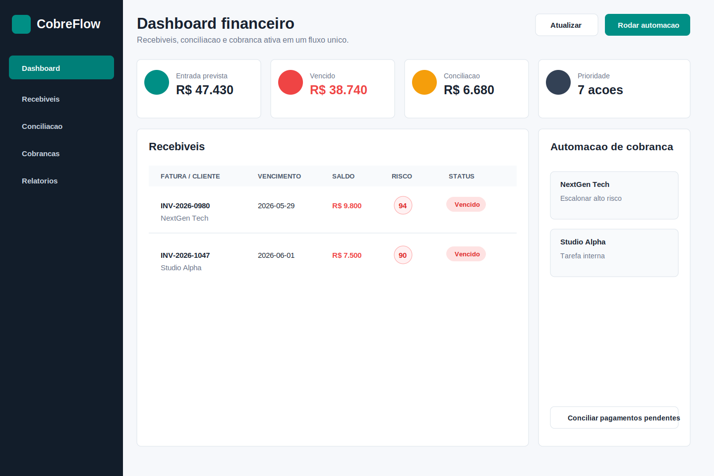

# CobreFlow Finance Ops

[](https://github.com/Kenjihidehira/cobreflow-finance-ops/actions/workflows/ci.yml)
[](https://cobreflow-finance.dadosepesquisa.chatgpt.site)

Painel financeiro completo para pequenas empresas acompanharem recebíveis, conciliação de pagamentos e cobrança ativa em um único fluxo operacional.

O projeto foi pensado como peça de portfólio para propostas freelance: ele resolve uma dor comercial clara, mostra tela, API, regras de negócio, dados de exemplo, automações simuladas e testes nativos.

## Prova comercial publicada

- **Demo:** [cobreflow-finance.dadosepesquisa.chatgpt.site](https://cobreflow-finance.dadosepesquisa.chatgpt.site)
- **Autenticação:** carteira demonstrável publicamente; conciliação e cobrança persistente exigem Sign in with ChatGPT.
- **Persistência:** recebíveis e histórico operacional usam workspace D1 isolado por usuário.
- **Integridade financeira:** a conciliação automática só ocorre com correspondência exata de cliente e valor.
- **Entrega:** CI, testes de domínio, build Vinext, migration reversível e deploy público versionado.
- **Arquitetura:** [`docs/architecture.md`](docs/architecture.md).

## Valor comercial

Pequenas empresas perdem caixa por atraso de pagamento, baixa manual de PIX ou boleto e falta de prioridade na cobrança. O CobreFlow centraliza:

- carteira de recebíveis com status e saldo em aberto;
- pontuação de risco por atraso, valor e histórico de contato;
- fila de cobrança automatizada por e-mail, WhatsApp ou tarefa interna;
- conciliação simulada de pagamentos pendentes;
- painel de KPIs para decisão rápida de caixa.

Esse tipo de sistema pode ser vendido para prestadores de serviço, agências, clínicas, assistências técnicas, pequenas distribuidoras e times financeiros que ainda controlam cobranças em planilhas.

## Prévia



## Funcionalidades

- Painel responsivo com KPIs de entrada prevista, vencidos, conciliação e ações prioritárias.
- Tabela de recebíveis com busca, filtro por status, filtro por canal e risco financeiro.
- API REST sem dependencias externas, usando Node.js nativo.
- Pontuação de risco calculada por saldo, dias vencidos, contato recente e promessa de pagamento.
- Simulação de envio de lembretes por automação.
- Simulação de conciliação de pagamentos pendentes.
- Dados de exemplo comerciais com clientes, faturas, canais e regras de automação.
- Testes unitarios e testes de API com `node:test`.
- Dockerfile pronto para publicação em plataformas que executam contêineres.

## Stack

- Node.js nativo
- HTML, CSS e JavaScript puro
- `node:test`
- Dados JSON de exemplo
- Docker
- Vinext/React e Cloudflare D1 na versão comercial hospedada

## Como rodar localmente

Requisito: Node.js 20 ou superior.

```bash
npm start
```

Acesse:

```text
http://localhost:3000
```

## Validação

```bash
npm test
npm run smoke
```

Ou tudo junto:

```bash
npm run validate
```

## Endpoints

### `GET /api/health`

Retorna status do serviço.

### `GET /api/summary`

Retorna KPIs financeiros:

- entrada prevista;
- saldo vencido;
- quantidade de faturas vencidas;
- prioridades;
- conciliação de pagamentos.

### `GET /api/receivables`

Lista recebíveis enriquecidos com saldo, status, dias vencidos, pontuação e prioridade.

Parametros opcionais:

- `status=all|overdue|partial|due_today|critical|high`
- `channel=all|PIX|Boleto|Cartao`
- `search=texto`

Exemplo:

```text
/api/receivables?status=overdue&channel=PIX&search=green
```

### `GET /api/automations`

Retorna regras de automação e fila priorizada de cobrança.

### `POST /api/reminders/run`

Simula envio de lembretes.

Body:

```json
{
  "limit": 3
}
```

### `POST /api/reconcile`

Simula conciliação automática de pagamentos pendentes quando cliente e valor batem com uma fatura aberta.

## Publicação

A prova comercial está ativa no [OpenAI Sites](https://cobreflow-finance.dadosepesquisa.chatgpt.site). O diretório `sites/` contém a versão hospedada com autenticação, D1 e pipeline de build; a implementação Node original permanece disponível para Docker.

### Docker

```bash
docker build -t cobreflow-finance-ops .
docker run -p 3000:3000 cobreflow-finance-ops
```

### Render, Railway, Fly.io ou similar

- Comando de compilação: não é necessário se usar Dockerfile.
- Comando de inicialização: `node src/server.js`
- Porta: usar variavel `PORT` fornecida pela plataforma.

## Possíveis melhorias comerciais

- Integração real com gateway PIX ou boleto.
- Permissões granulares por empresa e perfil.
- Webhooks de pagamento.
- Envio real por WhatsApp Business Cloud ou email transacional.
- Histórico completo de contatos por cliente.
- Exportação CSV/PDF para financeiro.
- Adaptador PostgreSQL para instalações fora do Sites.
- Painel de modelos de cobrança editáveis.

## Diferenciais para portfólio

- Foca em um problema comercial claro, não em CRUD genérico.
- Demonstra regras de negócio e priorização financeira.
- Mostra API, painel e automação no mesmo projeto.
- Inclui dados de exemplo realistas, testes e Dockerfile.
- Pode ser explicado em propostas como base de MVP para cobrança e contas a receber.
